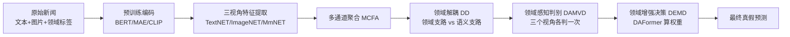

# DAMMFND 论文实现讲解

> **论文**：Domain-Aware Multimodal Multi-view Fake News Detection (AAAI-25)  
> **项目**：DAMMFND 代码对照说明  
> **说明**：本文档将论文方法与 `src/` 目录代码一一对应，便于读论文与读代码对照学习。

---

## 一、论文在解决什么问题？

虚假新闻检测面临三个核心难点：

1. **领域识别不准确**：一条新闻可能同时属于多个领域（如科技 + 经济），硬贴单一标签会引入噪声。
2. **跨领域数据不均衡**：社会类远多于军事类，共享参数容易偏向数据多的领域，造成负迁移。
3. **不同领域对各模态依赖不同**：政治更看重文字，娱乐更看重图片，不能一刀切。

**DAMMFND 核心思路：**

> 先把文本、图像、图文融合**三个视角**的特征提出来 → 把「领域信息」和「新闻语义」**拆开** → 用领域信息帮三个视角分别判真假 → 最后按领域**动态加权**三个视角的结果。

---

## 二、整体流程与代码入口



| 步骤 | 代码文件 |
|------|----------|
| 启动训练 | `src/run_weibo.py` → `src/run.py` |
| 模型 + 训练循环 | `src/model/dammfnd.py` |
| 数据加载 | `src/utils/clip_dataloader.py` |
| 图像预处理 | `src/weibo_build_pkl.py` |
| 领域标签构造 | `clip_dataloader.py` / `data_pre.py` 的 `_domain_labels` |
| 文本变体 | `src/model/dammfnd_text.py` |
| 评估指标 | `src/utils/utils.py` |

---

## 三、分模块详解 + 代码对照

### 模块 0：数据与领域标签（论文 Table 1）

**论文说什么：**  
Weibo / Weibo-21 按 9 个领域划分，一条新闻可有**多个领域标签**（多标签）。

**代码怎么做：**

```python
# src/utils/clip_dataloader.py
categories = []
for cat1, cat2 in zip(self.data['category'], self.data['领域']):
    if cat2 == "无领域":
        categories.append([self.category_dict[cat1]])
    else:
        categories.append([self.category_dict[cat1], self.category_dict[cat2]])

num_domains = 9
labels_multi_domain = torch.zeros(len(categories), num_domains)
for i, cat_list in enumerate(categories):
    labels_multi_domain[i, cat_list] = 1
```

- `category`：主领域（如「政治」）
- `领域`：第二领域（没有则「无领域」）
- 得到 `multi_category`：形状 `[N, 9]` 的 0/1 向量 → 对应论文式 (11) 的多标签领域分类

领域字典在 `src/run.py`：

```python
self.category_dict = {
    "经济": 0, "健康": 1, "军事": 2, "科学": 3,
    "政治": 4, "国际": 5, "教育": 6, "娱乐": 7, "社会": 8
}
```

图像侧：`weibo_build_pkl.py` 生成 `train_loader.pkl`（MAE 用图）和 `train_clip_loader.pkl`（CLIP 用图），`run_weibo.py` 读 `train_aligned.csv` 对齐图文。

---

### 模块 1：多视角特征提取（论文 §3.1，式 1–5）

**论文说什么：**

- **文本视角**：BERT → TextCNN（TextNET）
- **图像视角**：MAE → CNN（ImageNET）
- **多模态视角**：CLIP 图文特征，按相关性加权融合 → MLP（MmNET）

**代码对应（`dammfnd.py` forward 第 343–363 行）：**

```python
text_feature = self.bert(inputs, attention_mask=masks)[0]      # BERT
image_feature = self.image_model.forward_ying(image)           # MAE
clip_image_feature = self.ClipModel.encode_image(clip_image)   # CLIP
clip_text_feature = self.ClipModel.encode_text(clip_text)
clip_fusion_feature = torch.cat((clip_image_feature, clip_text_feature), dim=-1)
clip_fusion_feature = self.clip_fusion(clip_fusion_feature.float())
```

| 论文组件 | 代码 |
|----------|------|
| BERT 文本编码 | `self.bert`（冻结） |
| MAE 图像编码 | `self.image_model` |
| CLIP 图文编码 | `self.ClipModel` |
| TextNET (TextCNN) | `cnn_extractor` + `self.text_experts` |
| ImageNET (CNN) | `cnn_extractor` + `self.image_experts` |
| MmNET (MLP) | `self.fusion_experts`、`self.clip_fusion` |

`cnn_extractor` 定义在 `src/model/layers.py`，即论文里的 TextCNN / ImageNET。

注意力池化：

```python
text_atn_feature = self.text_attention(text_feature, masks)    # MaskAttention
image_atn_feature, _ = self.image_attention(image_feature)    # TokenAttention
fusion_atn_feature, _ = self.fusion_attention(fusion_feature)
```

**与论文的小差异：** 论文式 (3)(4) 用 CLIP 图文**余弦相似度**加权；代码是**直接拼接**再过 `clip_fuion` MLP。

---

### 模块 2：多通道特征聚合 MCFA（论文 §3.1，式 6–8，k=18）

**论文说什么：** 每个模态用 18 个通道，再用门控网络加权求和。

**通俗理解：** 同一篇新闻，让 18 个「小专家」从不同角度抽特征，再按重要性加权合并。

**代码对应（`dammfnd.py` 第 370–475 行）：**

论文里的 18 通道 = **6 个私有专家 + 12 个共享专家**：

```python
self.num_expert = 6  # 6 私有 + 12 共享 = 18 路门控

for j in range(self.num_expert):
    tmp_expert = self.text_experts[i][j](text_feature)
    gate_expert += (tmp_expert * text_gate_out_list[i][:, j].unsqueeze(1))
for j in range(self.num_expert * 2):  # 12 个共享专家
    tmp_expert = self.text_share_expert[0][j](text_feature)
    gate_expert += (tmp_expert * text_gate_out_list[i][:, (self.num_expert + j)].unsqueeze(1))
```

门控 `text_gate_list` 输出 18 维权重，对应论文式 (6) 的 `softmax(G_text(e_t))`。

聚合后用 `att_mlp_text` 拆成两支（为领域解耦做准备）：

```python
att = F.softmax(self.att_mlp_text(text_experts_feature), dim=-1)
text_experts_feature0 = att[:, 0].view(-1, 1) * text_experts_feature  # 支路 0
text_experts_feature1 = att[:, 1].view(-1, 1) * text_experts_feature  # 支路 1
```

图像、多模态分支同理。`forward` 中注释 `# Multi-view Features Extraction and Aggregation` 即本模块。

---

### 模块 3：领域解耦 DD（论文 §3.2，式 9–12）

**论文说什么：**

- **领域支路**：预测「这条新闻属于哪些领域」（多标签 BCE，式 11）
- **语义支路**：学习「不含领域信息」的表示（预测接近均匀分布，KL 损失，式 12）

**代码对应（第 478–499 行）：**

```python
text_two_task.append(self.text_classifier(text_gate_expert_value[0]).squeeze(1))      # 1 维
text_two_task.append(self.text_classifier_Mu(text_gate_expert_value[1]).squeeze(1))   # 9 维

text_fake_news = torch.softmax(text_two_task[0], -1)
text_multi_domain = torch.softmax(text_two_task[1], -1)
# Domain Disentanglement
```

| 论文 | 代码 |
|------|------|
| 领域支路 + L_dom | `text_classifier_Mu`（9 类）+ `loss11/21/31` |
| 语义支路 + L_se | `text_classifier` + `loss12/22/32`（KL） |

损失在 `Trainer.train()`（第 593–606 行）：

```python
loss11 = BCE(text_multi_domain, labels_domain)   # 领域分类
uniform_target = torch.ones_like(text_fake_news) / 9
loss12 = F.kl_div(text_fake_news, uniform_target)  # 语义支路均匀约束
```

`MLP_Mu` 输出 9 维，定义在 `src/model/layers.py`。

**与论文差异：** 论文用两个 MLP 做软掩码分离；代码用 `att_mlp` 注意力权重软分离 + 双分类头约束。

---

### 模块 4：领域感知多视角判别器 DAMVD（论文 §3.3，式 13–14）

**论文说什么：** 三个视角各自判一次真假；用门控筛掉对判假无用的领域特征，再与语义特征拼接后预测。

**代码对应（第 506–517 行）：**

```python
# Domain-Aware Multi-View Discriminator
text_domain_features = self.gate_text_prefer(fake_news_feature) * text_domain_features

domain_aware_text_view = torch.sigmoid(
    self.domain_aware_text_classifier(text_gate_expert_value[0] + text_domain_features)
)
# image、fusion 同理
```

| 论文 | 代码 |
|------|------|
| G_i = σ(Gate_i(f_se)) 式 (13) | `gate_text_prefer(fake_news_feature)` 等 |
| p_dom_i = G_i ⊗ f_dom_i 式 (14) | `gate_*_prefer * domain_features` |
| 领域 + 语义 → 各视角预测 | `domain_aware_*_classifier(语义 + 过滤后领域)` |

`fake_news_feature` 来自三模态语义支路之和（第 503 行）。

各视角辅助损失（第 599–601 行）：

```python
loss12_aux = BCE(domain_aware_text_view, label)
loss22_aux = BCE(domain_aware_image_view, label)
loss32_auc = BCE(domain_aware_fusion_view, label)
```

---

### 模块 5：领域增强多视角决策层 DEMD（论文 §3.4，式 15–19）

**论文说什么：** 用 **DAFormer** 根据领域信息给三个视角的预测动态分配权重，再加权得到最终结果。

**代码对应：**

`DomainAwareTransformer` 类（第 19–85 行）即论文的 **DAFormer**：

```python
def forward(self, modality_reps, domain_rep):
    global_rep = torch.mean(torch.stack(modality_reps, dim=1), dim=1)  # 式 (15)
    q = self.q_proj(domain_rep + global_rep)                           # 式 (16)
  # MultiHeadAttention + FFN + LayerNorm  →  式 (17)
    weights = F.softmax(self.weight_proj(domain_rep), dim=-1)          # 式 (18)
```

最终加权融合（式 19，第 519–524 行）：

```python
weight_common = self.attention(
    [text_gate_expert_value[0], image_gate_expert_value[0], fusion_gate_expert_value0[0]],
    multi_label_feature)

fake_news_sigmoid = (
    weight_common[:, 0] * domain_aware_text_view +
    weight_common[:, 1] * domain_aware_image_view +
    weight_common[:, 2] * domain_aware_fusion_view
)
```

---

### 模块 6：总损失（论文式 20）

**论文：**

```
L = L_final + α_fnd(L_text + L_img + L_mm) + α_dom·L_dom + α_se·L_se
```

**代码（第 590–608 行）：**

```python
loss0 = BCE(label0, label)                         # L_final
loss11/21/31 = BCE(multi_domain, labels_domain)    # L_dom
loss12/22/32 = KL(fake_news, uniform)             # L_se
loss12_aux/22_aux/32_auc = BCE(各视角, label)      # 多视角真假损失

loss = loss0 + (loss11 + ... + loss32) / 6 + (loss12_aux + ...) / 3.0
```

论文设 α=0.25；代码将多类损失**平均组合**，属于实现上的简化。

---

## 四、一次 forward 数据流

```
输入 batch
  ├─ content, masks        → BERT → text_feature
  ├─ image                 → MAE  → image_feature
  └─ clip_image, clip_text → CLIP → clip_fusion_feature

第 343–363 行  三模态预训练编码
第 370–475 行  MCFA（专家混合 + 双支路拆分）
第 478–499 行  领域解耦（两个分类头）
第 506–517 行  DAMVD（三门控 + 三视角 sigmoid 预测）
第 519–524 行  DEMD（DAFormer 权重 + 加权融合）
第 528 行      返回最终预测 + 各中间结果（供 loss 用）
```

---

## 五、训练与评估

```python
# src/run.py
from model.dammfnd import Trainer as SGDOMAINTrainer
```

- `run_weibo.py`：配置 `max_len=197`、BERT 路径、batch、lr 等
- `Trainer.train()`：Adam + BCE + 多任务损失
- 模型保存：`parameter_dammfnd.pkl`
- 评估：`metricsTrueFalse` 按领域统计 Accuracy / F1

---

## 六、论文 vs 代码主要差异

| 项目 | 论文 | 本仓库代码 |
|------|------|------------|
| 图文融合 | 余弦相关加权式 (3)(4) | CLIP 特征拼接 + MLP |
| 领域解耦 | 软掩码 MLP 硬拆两支 | `att_mlp` 软权重 + 双分类头 |
| 18 通道 | 18 个 TextNET 等 | 6 专家 + 12 共享专家（18 路门控） |
| 损失权重 | 显式 α=0.25 | 多损失简单平均 |
| 图像 CNN | 独立 ImageNET | 与文本共用 `cnn_extractor` 结构 |

整体架构与论文图 2 一致：**特征提取 → 解耦 → 判别 → 决策** 四阶段一一对应。

---

## 七、相关文件速查

| 文件 | 作用 |
|------|------|
| `src/model/dammfnd.py` | 主模型 + 训练器（全模态） |
| `src/model/dammfnd_text.py` | 文本三视角变体 |
| `src/model/layers.py` | `cnn_extractor`、`MLP`、`MLP_Mu`、注意力层 |
| `src/run_weibo.py` | Weibo 多模态训练入口 |
| `src/run.py` | 数据集配置与 Run 基类 |
| `src/weibo_build_pkl.py` | 图像 pkl 构建 |
| `src/utils/clip_dataloader.py` | 多模态 DataLoader |
| `src/data_pre.py` | 文本数据与领域标签 |
| `Domain-aware multimodal multi-view fake news detection.pdf` | 原论文 |

---

## 八、消融实验对照（论文 Table 4）

| 论文变体 | 代码中对应操作 |
|----------|----------------|
| w/o MCFA | 去掉多通道专家聚合，直接用单路特征 |
| w/o DD | 去掉双支路拆分及领域/语义损失 |
| w/o DAMVD(gate) | 去掉 `gate_*_prefer` 门控 |
| w/o DAMVD(views) | 去掉三视角独立分类器 |
| w/o DEMD | 去掉 `DomainAwareTransformer`，三视角简单平均 |
